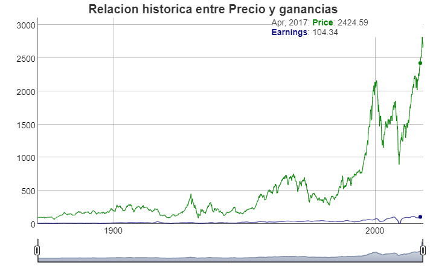
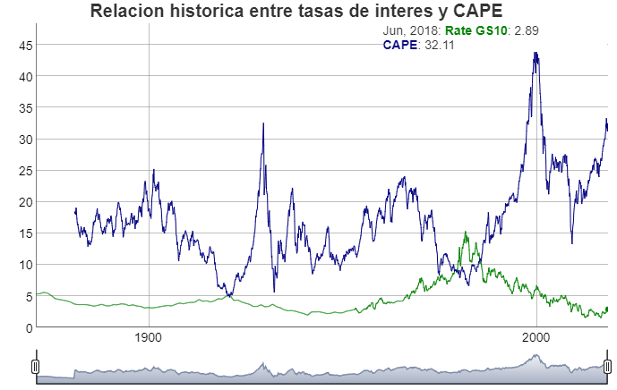

<!-- README.md is generated from README.Rmd. Please edit that file -->

```{r, echo = FALSE}
knitr::opts_chunk$set(
  collapse = TRUE,
  comment = "#>",
  fig.path = "man/figures/"
)
```

# BehavioralEconomicsR 

[](https://www.tidyverse.org/lifecycle/#maturing)

BehavioralEconomicsR es un paquete disenado para trabajar facilmente con data publica de investigaciones de Economia Conductual, de forma gratuita, libre y facil. Este proyecto 
es creado por [Behavioral Economics & Data Science Team (BEST)](http://besteamperu.org). Aprende a utilizarlo con nuestros ejemplos en <https://bestdatascience.github.io/BehavioralEconomicsR/index.html>.

## Instalacion

Lo primero que debemos hacer es instalar primero R en este [enlace](https://cran.r-project.org/bin/windows/base/) y luego RStudio en este [enlace](https://download1.rstudio.org/RStudio-1.1.453.exe). Posteriormente dentro de la consola se debera poner los siguientes scripts 

```{r, eval = FALSE}
# Los paquetes nuevos son instalados a traves de la funcion install.packages(), siempre entre comillas

install.packages("xts")
install.packages("zoo")
install.packages("dygraphs")
install.packages("devtools")
install.packages("lubridate")
devtools::install_github("BESTDATASCIENCE/BehavioralEconomicsR")

```

## Activacion de paquetes

Utilicemos la funcion `library()` para activar los paquetes instalados.

```{r, eval = F,message=FALSE,warning=FALSE,results='asis'}
library(BehavioralEconomicsR)
library(xts)
library(dygraphs)
library(lubridate)
```

## A probar el paquete con el trabajo de Shiller!!

El paquete cuenta con data del libro de Shiller Irrational Exuberance y lo puedes usar facilmente utilizando el siguiente script:


```{r, eval = F,message=FALSE,warning=FALSE,results='asis'}
data("ie_data")
be=xts::xts(ie_data[,c(8,10)],order.by = ie_data$Date)
be2=xts::xts(ie_data[,c(7,11)],order.by = ie_data$Date)
```

### Hora de Graficar

Veamos la relacion entre precio y ganancias:

```{r, eval = F,message=FALSE,warning=FALSE,results='asis'}
dygraphs::dygraph(be, 
        main = "Relacion historica entre Precio y ganancias") %>% 
  dyRangeSelector()
```



Veamos la relacion entre CAPE y tasas de interes:


```{r, eval = F,message=FALSE,warning=FALSE,results='asis'}
dygraphs::dygraph(be2, 
        main = "Relacion historica entre tasas de interes y CAPE") %>% 
  dyRangeSelector()
```



## Codigo de conducta

Por favor considerar que este paquete cuenta con un [Codigo de Conducta del Contribuidor](CODE_OF_CONDUCT.md). Al participar en este proyecto o utilizarlo, se asume que estas de acuerdo con estos terminos.
